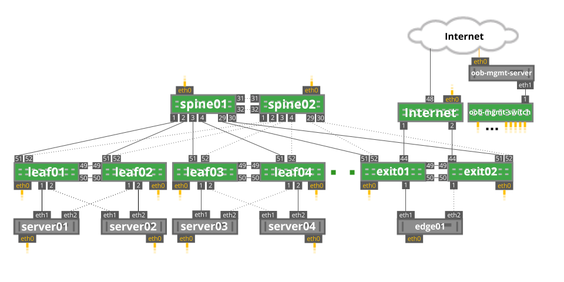

Cumulus Multicast Routing / PIM Demo
================
This demo will demonstrate how to configure and use PIM on Cumulus Linux.

This demo is built using the Cumulus [reference topology](https://github.com/CumulusNetworks/cldemo-vagrant). Please visit the reference topology github page for detailed instructions on using Cumulus Vx with Vagrant

Quickstart
------------------------
* git clone https://github.com/cumulusnetworks/cldemo-vagrant
* cd cldemo-vagrant
* vagrant up
* vagrant ssh oob-mgmt-server
* sudo su - cumulus
* git clone <URL>
* cd cldemo-pim
* ansible-playbook provision.yml

Details
------------------------
First, the Cumulus PIM EA packages will be downloaded from the Cumulus Networks Apt repo and installed on all network devices.

The lab is configured with (numbered) OSPF. A number of links have been not been configured (dotted lines in the topology), leaving each server single homed to a single leaf switch.

Each leaf switch has a bridge interface configured with the server ports.

Spine01 is configured as the multicast RP at 10.0.0.21

Each server has a test multicast sender and test multicast receiver application. This is located in the /home/cumulus on each server.

**Multicast Source**. The application *mcast-tx.py* allows for the generation of multicast data. To use the application use the command
`sudo python mcast-tx.py 239.1.1.1 eth1 --count 100 --interval 1000`
to send 100 packets to the multicast group 239.1.1.1, sourced from the eth1 interface. Each packet will be sent 1000 ms apart.
To stop sending traffic send a break (Ctrl-C)

**Multicast Receiver**. The application *mcast-rx.py* allows for the sending of IGMPv3 wildcard (0.0.0.0) joins to pull multicast data. To use the application use the command
`sudo python mcast-rx.py 239.1.1.1 eth1`
to request the group 239.1.1.1 on the eth1 interface.
To stop the periodic sending of IGMPv3 Joins send a break (Ctrl-C)

### Known Issues
spine01 ports swp29 and swp30 are swapped.  spine01 is connected to exit01 on port swp30. This will be corrected in a future version of the reference topology.

ECMP is not currently supported and a number of links have been disabled to simplify the environment.

PIM with mLAG is not currently supported. No dual attached servers are configured.
